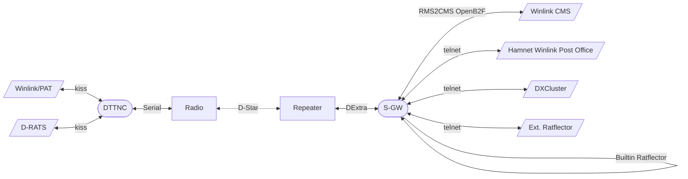

# D-Star Service Gateway

> [!CAUTION]
> For now, this repo is a scratchpad to collect ideas.

A D-Star Service Gateway is used to connect Packet Applications to a wider network.
It communicates with a remote [D-Star DV TNC](https://github.com/dscp46/dttnc/) to assist other applications to get connected to online services on IP networks (Hamnet/Internet).

Our main goals
  * Make WL2K work over D-Star DV data
  * DXCluster?
  * Dedicated channel for D-Rats Ratflector (one for local reflection, another for bridging to a network Ratflector)

## General architecture

